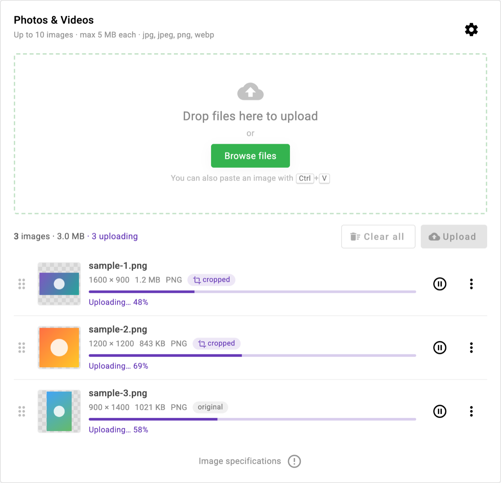
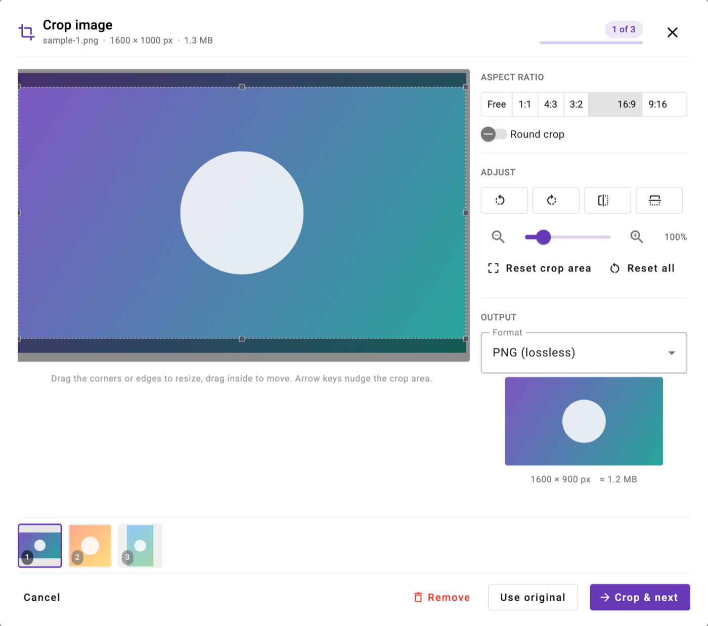
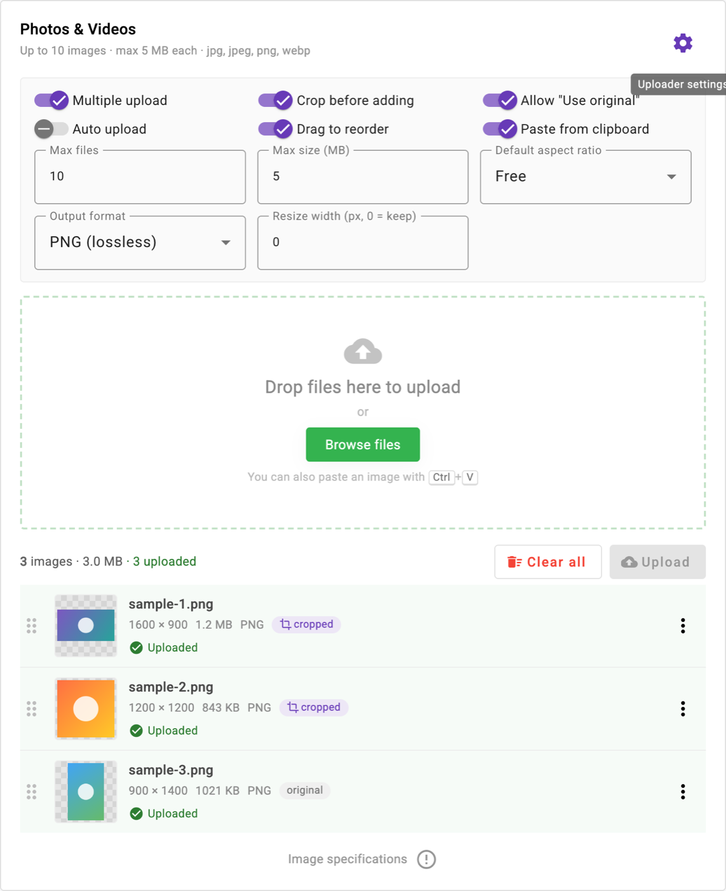

# Angular Image Uploader

[](https://www.npmjs.com/package/angular-material-image-uploader)
[](https://github.com/00Arun/AngularImageUploader/actions/workflows/ci.yml)
[](https://angular.dev)
[](image-uploader/projects/angular-material-image-uploader/LICENSE)

Source for the [`angular-material-image-uploader`](https://www.npmjs.com/package/angular-material-image-uploader) npm package:
an Angular Material image uploader with drag & drop, clipboard paste, a multi-image batch cropper,
previews, reordering, and upload progress. Angular 22, standalone components, signals, zoneless-ready.

<p align="center">
  
</p>

| Batch cropper | Settings panel |
| --- | --- |
|  |  |

## Use the package

```bash
npm install angular-material-image-uploader @angular/material @angular/cdk ngx-image-cropper ngx-toastr
```

```ts
// app.config.ts
import { provideAngularMaterialImageUploader } from 'angular-material-image-uploader';
export const appConfig = { providers: [provideAngularMaterialImageUploader()] };
```

```html
<app-angular-material-uploader
  [config]="{ multiple: true, maxFiles: 10, maxFileSizeMB: 5, cropBeforeAdd: true }"
  [showSettingsButton]="true"
  (imageDetails)="getImageDetails($event)">
</app-angular-material-uploader>
```

Full setup, every config option, outputs, and the v1 to v2 upgrade guide are in the
[package README](image-uploader/projects/angular-material-image-uploader/README.md).
Release notes are in the [CHANGELOG](image-uploader/projects/angular-material-image-uploader/CHANGELOG.md).

## Repository layout

```
image-uploader/
├── projects/angular-material-image-uploader/   # the library (published to npm)
│   ├── src/lib/                                # components, services, config, models
│   ├── README.md · CHANGELOG.md · LICENSE       # shipped inside the npm package
│   └── package.json                            # package name, version, peer deps
├── src/                                        # demo app that consumes the library
└── angular.json                                # workspace: "angular-material-image-uploader" + "image-uploader"
docs/screenshots/                               # images used by the READMEs
.github/workflows/ci.yml                        # audit, build, test on every push / PR
```

## Develop

Requires Node 22.22+ (`nvm use` reads `image-uploader/.nvmrc`).

```bash
cd image-uploader
npm ci --legacy-peer-deps      # ngx-toastr declares Angular 21 peers; it works on 22
npm start                      # builds the library, then serves the demo at http://localhost:4200
npm test                       # Vitest
npm run build                  # library + demo production build
npm run pack:lib               # dry-run: shows exactly what would be published
```

## Release

1. Update the version in `projects/angular-material-image-uploader/package.json` and add a CHANGELOG entry.
2. Commit and tag (`git tag -a vX.Y.Z`), push the branch and the tag.
3. `npm run publish:lib` (needs `npm login` and a 2FA code).
4. Create a GitHub release for the tag and paste the CHANGELOG entry.

## Security

- `npm audit` runs in CI on every push and pull request; Dependabot keeps npm packages and GitHub Actions current.
- Files never leave the browser unless `config.uploadUrl` is set; with it, each file is POSTed as `multipart/form-data`.
- File names are always rendered as plain text.

## License

MIT
